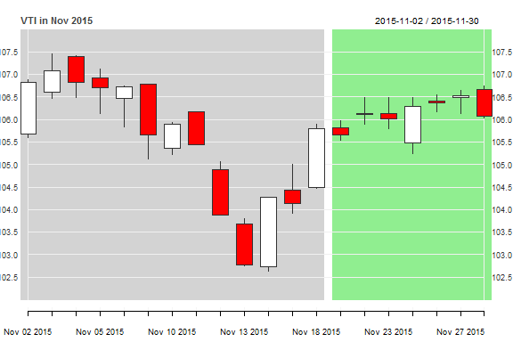

The *rutils* package is a collection of functions for simplifying data management and modeling, and is used by most of my other packages.  
The *rutils* package contains functions for:

- extracting names and columns from time series, 
- calculating the end points of a time series, 
- applying lags to vectors and matrices, 
- calculating row differences of vectors and matrices, 
- recursively binding a list of objects into time series, 
- recursively applying a function to a list of objects, 
- plotting time series with custom axis range and background shading. 

The *rutils* package also includes a dataset with *OHLC* time series data for a portfolio of symbols.  The data is contained in an environment called *env_etf*, which includes: 

- *sym_bols*: a vector of strings with the portfolio symbols.
- individual time series *VTI*, *VEU*, etc., containing daily *OHLC* prices for all the sym_bols.
- *price_s*: a single *xts* time series containing daily closing prices for all the sym_bols.
- *re_turns*: a single *xts* time series containing daily returns for all the sym_bols.

Each individual *xts* time series contains the columns: Open prices, High prices, Low prices, Close prices, trading Volume, Adjusted prices.


========

### Installation and loading

Installing *rutils* package from *GitHub*:  

```r
install.packages("devtools")
library(devtools)
install_github(repo="algoquant/rutils")
library(rutils)
```

========

### Data

The *rutils* package contains a dataset of daily *OHLC* time series in *xts* format, for a portfolio of stock symbols.  The time series are contained in an environment called *env_etf*.  The data is set up for lazy loading, so it doesn't require calling `data(etf_data)` to load it before being able to call it.  

```r
# get first six rows of VTI prices
head(env_etf$VTI)
# plot
chart_Series(x=env_etf$VTI["2009-11"])
```


========

### Examples

Extract the name of an *OHLC* time series from its first column name:  

```r
# show portfolio symbols
env_etf$sym_bols
```

```
##  [1] "VTI" "VEU" "IEF" "VNQ" "DBC" "VXX" "XLY" "XLP" "XLE" "XLF" "XLV"
## [12] "XLI" "XLB" "XLK" "XLU" "VYM" "IVW" "IWB" "IWD" "IWF"
```

```r
# get name for VTI
na_me(env_etf$VTI)
```

```
## [1] "VTI"
```

```r
# get first six rows of VTI prices
head(env_etf$VTI)
```

```
##            VTI.Open VTI.High  VTI.Low VTI.Close VTI.Volume VTI.Adjusted
## 2007-01-03 58.67240 58.75969 57.79948  58.17359     798600     58.17359
## 2007-01-04 58.17359 58.43962 57.84936  58.28998    3305000     58.28998
## 2007-01-05 58.19437 58.19437 57.71635  57.82858     382000     57.82858
## 2007-01-08 57.99485 58.11539 57.63321  58.04058     299000     58.04057
## 2007-01-09 58.15280 58.15280 57.71635  58.04058     267000     58.04057
## 2007-01-10 57.85352 58.23594 57.76623  58.16943     359200     58.16943
```

```r
# get first six rows of price_s
env_etf$price_s[1:6, 1:4]
```

```
##                 DBC      IEF      IVW      IWB
## 2007-01-03 22.86394 63.61983 56.29234 64.31569
## 2007-01-04 22.26832 63.85067 56.44878 64.40781
## 2007-01-05 22.19147 63.64291 56.24019 64.02258
## 2007-01-08 22.30675 63.68908 56.31842 64.20682
## 2007-01-09 22.11461 63.67369 56.37056 64.14820
## 2007-01-10 21.78799 63.56596 56.50961 64.33244
```

```r
# get first six rows of re_turns
env_etf$re_turns[1:6, 1:4]
```

```
##                     DBC           IEF           IVW           IWB
## 2007-01-03  0.000000000  0.0000000000  0.0000000000  0.0000000000
## 2007-01-04 -0.026050371  0.0036284915  0.0027790639  0.0014322944
## 2007-01-05 -0.003451226 -0.0032538577 -0.0036951200 -0.0059811071
## 2007-01-08  0.005194744  0.0007254068  0.0013908914  0.0028777192
## 2007-01-09 -0.008613224 -0.0002415956  0.0009258783 -0.0009130027
## 2007-01-10 -0.014769781 -0.0016918448  0.0024668019  0.0028720839
```


Calculate a vector of equally spaced end points for a time
series:  

```r
# calculate end points with initial stub interval
end_points(env_etf$VTI, inter_val=7, off_set=4)
```


Extract close prices from an *OHLC* time series:  

```r
# get close prices for VTI
clo_se(env_etf$VTI)
# get volumes for VTI
clo_se(env_etf$VTI, which_col="vol")
```


Apply a lag to a vector or matrix:  

```r
# lag vector by 2 periods
lag_it(1:10, lag=2)
# lag matrix by negative 2 periods
lag_it(matrix(1:10, ncol=2), lag=-2)
```


Calculate the row differences of a vector or matrix:  

```r
# diff vector by 2 periods
diff_it(1:10, lag=2)
# diff matrix by negative 2 periods
diff_it(matrix(1:10, ncol=2), lag=-2)
```


Calculate the time differences of an *xts* time series and pad with zeros:  

```r
# calculate time differences over lag by 10 periods
rutils::diff_xts(env_etf$VTI, lag=10)
```


Recursively rbind a list of objects:  

```r
# create xts time series
x_ts <- xts(x=rnorm(1000), order.by=(Sys.time()-3600*(1:1000)))
# split time series into daily list
list_xts <- split(x_ts, "days")
# rbind the list back into a time series and compare with the original
identical(x_ts, do_call_rbind(list_xts))
```


Recursively apply a function to a list of objects:  

```r
# create xts time series
x_ts <- xts(x=rnorm(1000), order.by=(Sys.time()-3600*(1:1000)))
# split time series into daily list
list_xts <- split(x_ts, "days")
# rbind the list back into a time series and compare with the original
identical(x_ts, do_call(rbind, list_xts))
```


Apply a function to a list of objects, merge the outputs into a single object, and assign the object to the output environment:  

```r
do_call_assign(
   func_tion=clo_se,
   sym_bols=env_etf$sym_bols,
   out_put="price_s",
   env_in=env_etf, env_out=new_env)
```


Plot an *xts* time series with custom y-axis range and with vertical background shading:  

```r
chart_xts(env_etf$VTI["2015-11"],
name="VTI in Nov 2015", ylim=c(102, 108),
in_dex=index(env_etf$VTI["2015-11"]) > as.Date("2015-11-18"))
```

<!-- -->

